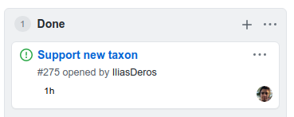

# Github Project Invoice

For some **freelance contracts**, I use [Github projects](https://github.com/features/project-management/) to track progress and time estimates, which need to be manually processed for billing. This script helps generate the rows in **markdown** format for an invoice.



## Prerequisites
- Node & `yarn`
- A [github access token](https://github.com/settings/tokens) including `repo` and `read:org` scopes
- A github repo with project(s) that include a "Done" column and "0h" labels

## Getting Started
1. Install dependencies (dotenv & graphql) - `yarn`
2. Configure environment variables - See `.env`
2. Run the script - `yarn start`

## The script does the following
1. Find projects in a repo
2. Identify all issue cards in the _Done_ column
3. For each card, add a row to invoice_items.csv containing `name,hours`

```
NAME,HOURS
Issue Name - [#1](github.com/link/to/issue/1),12
```

## Deployment
For convenience, the script is deployed on vercel. See https://github-project-invoice.vercel.app/api
